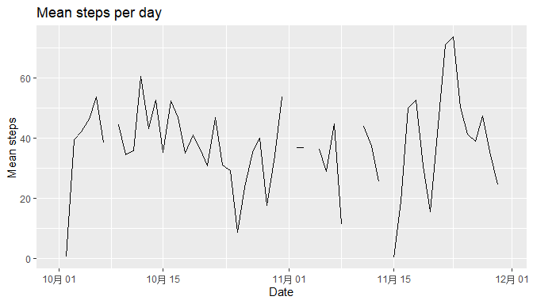

```global
library(knitr)
knitr::opts_chunk$set(warning=FALSE,echo = TRUE)
```
Reading of data

```r
getwd()
```

```
## [1] "C:/Users/51666/Desktop/RepData_PeerAssessment1"
```

```r
data<-read.csv("C:/Users/51666/Desktop/R coursera/course 5 project 1/activity.csv")
library(ggplot2)
library(dplyr)
```

```
## 
## Attaching package: 'dplyr'
```

```
## The following objects are masked from 'package:stats':
## 
##     filter, lag
```

```
## The following objects are masked from 'package:base':
## 
##     intersect, setdiff, setequal, union
```

```r
head(data)
```

```
##   steps       date interval
## 1    NA 2012-10-01        0
## 2    NA 2012-10-01        5
## 3    NA 2012-10-01       10
## 4    NA 2012-10-01       15
## 5    NA 2012-10-01       20
## 6    NA 2012-10-01       25
```

```r
summary(data)
```

```
##      steps                date          interval     
##  Min.   :  0.00   2012-10-01:  288   Min.   :   0.0  
##  1st Qu.:  0.00   2012-10-02:  288   1st Qu.: 588.8  
##  Median :  0.00   2012-10-03:  288   Median :1177.5  
##  Mean   : 37.38   2012-10-04:  288   Mean   :1177.5  
##  3rd Qu.: 12.00   2012-10-05:  288   3rd Qu.:1766.2  
##  Max.   :806.00   2012-10-06:  288   Max.   :2355.0  
##  NA's   :2304     (Other)   :15840
```
###Diagram 1 

```r
data1<- data%>%
        group_by(date)%>%
        summarise(total = sum(steps,na.rm = T))
hist(data1$total,breaks = seq(0,25000, by = 2500),
        xlab = "Total steps per day",main = "histogram of total steps per day",
        col = "red")
```

<!-- -->

Mean and median number of steps taken each day

```r
mean1<- mean(data$steps,na.rm = T)
median1<- median(data$steps, na.rm = T)
print(mean1);print(median1)
```

```
## [1] 37.3826
```

```
## [1] 0
```
  

Diagram 2 

```r
data2<- data%>%
        group_by(date)%>%
        summarise(mean = mean(steps,na.rm = T),
                median = median(steps))
data2$date<-as.Date(data2$date)

g2<-ggplot(data2, aes(x = date, y = mean))
g2 + geom_line()+
        labs(title = "Mean steps per day",
                y = "Mean steps",
                x = "Date")
```

```
## Warning: Removed 2 rows containing missing values (geom_path).
```

<!-- -->

The 5-minute interval that, on average, contains the maximum number of steps


```r
data3<- data%>%
        group_by(interval)%>%
        summarise(mean = mean(steps,na.rm = T),
                max = max(steps,na.rm = T))
data3
```

```
## # A tibble: 288 x 3
##    interval   mean   max
##       <int>  <dbl> <int>
##  1        0 1.72      47
##  2        5 0.340     18
##  3       10 0.132      7
##  4       15 0.151      8
##  5       20 0.0755     4
##  6       25 2.09      52
##  7       30 0.528     28
##  8       35 0.868     46
##  9       40 0          0
## 10       45 1.47      72
## # ... with 278 more rows
```

Number of missing value


```r
datana<- data %>%
        filter(is.na(steps))
nrow(datana)
```

```
## [1] 2304
```

Imputing and diagram

```r
datana$steps <- data3$mean[match(datana$interval, data3$interval)]
data$steps[is.na(data$steps)] <- datana$steps

data4<- data%>%
        group_by(date)%>%
        summarise(total = sum(steps,na.rm = T))
hist(data4$total,breaks = seq(0,25000, by = 2500),
        xlab = "Total steps per day",main = "histogram of total steps per day",
        col = "red")
```

<!-- -->

Diagram 5

```r
Sys.setlocale(locale="English_United States") 
```

```
## [1] "LC_COLLATE=English_United States.1252;LC_CTYPE=English_United States.1252;LC_MONETARY=English_United States.1252;LC_NUMERIC=C;LC_TIME=English_United States.1252"
```

```r
data$days <- ifelse(weekdays(as.Date(data$date)) == c("Saturday","Sunday"),"weekends","weekdays")

data5<- data %>%
        group_by(days,interval)%>%
        summarise(mean = mean(steps))

g3<-ggplot(data5, aes(x = interval, y = mean,colour = days))
g3 + geom_line()+
        facet_grid(days~.)+
        theme_grey()+
        ggtitle("Mean Steps per interval of week/weekend")+
        labs(y = "Mean Steps")
```

<!-- -->


